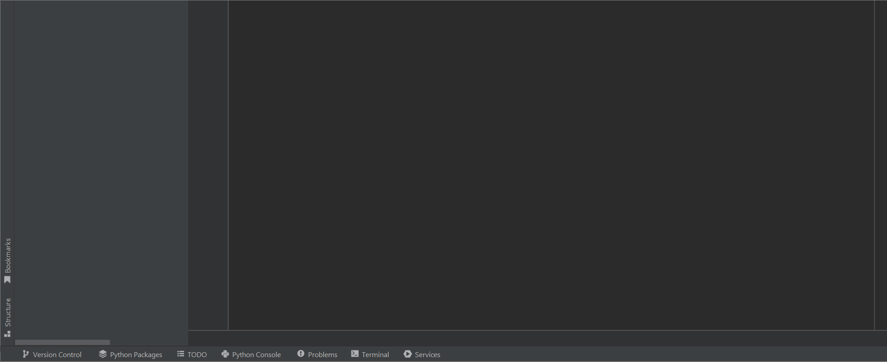

# NumVerify API Test

This is an api test project, created by Karoly Puskas

## Demo

## Installation

1. To be able to run the tests, an api key needs to be generated at 
https://docs.apilayer.com/numverify/docs/api-documentation
2. Set up the api key as an environment variable

## Test Cases
| Test Name                         | Scenario/ID               | Input Number    | Country Code | Format  | Expected Status | Expected Valid | Validation Used                                | Why This Validation?                                                                       |
|-----------------------------------|---------------------------|-----------------|--------------|---------|-----------------|----------------|------------------------------------------------|--------------------------------------------------------------------------------------------|
| test_number_verified              | Valid default values      | 14158586273     | (empty)      | (empty) | 200 (OK)        | True           | Schema validation, value checks                | Ensures API returns correct structure and values for a valid US number with default params |
| test_number_verified              | Valid HU number           | 201234567       | HU           | 1       | 200 (OK)        | True           | Schema validation, value checks                | Ensures correct response for a valid Hungarian number                                      |
| test_error_responses              | no_phone_number           | None            | N/A          | N/A     | 400 (Bad Req)   | N/A            | Error response structure, error code/type/info | Checks API returns proper error and structure when no phone number is provided             |
| test_error_responses              | invalid_access_key        | 14158586273     | N/A          | N/A     | 200 (OK)        | N/A            | Error response structure, error code/type/info | Ensures API returns error info in body when API key is invalid                             |
| test_error_responses              | Special characters        | !@#$%           | N/A          | N/A     | 400 (Bad Req)   | N/A            | Error response structure, error code/type/info | Validates API rejects non-numeric phone numbers and returns proper error                   |
| test_error_responses              | Empty string phone number | ""              | N/A          | N/A     | 400 (Bad Req)   | N/A            | Error response structure, error code/type/info | Ensures API handles empty string as phone number and returns correct error                 |
| test_number_validation_edge_cases | Non-numeric input         | abc123          | (empty)      | 1       | 200 (OK)        | False          | Validity check, value check                    | Checks that API marks non-numeric input as invalid                                         |
| test_number_validation_edge_cases | Shortest valid US number  | 1234567         | US           | 1       | 200 (OK)        | True           | Validity check, value check                    | Ensures API accepts shortest valid US number                                               |
| test_number_validation_edge_cases | Longest valid US number   | 123456789012345 | US           | 1       | 200 (OK)        | False          | Validity check, value check                    | Ensures API rejects overly long US numbers                                                 |
| test_number_validation_edge_cases | Invalid country code      | 14158586273     | ZZ           | 1       | 200 (OK)        | True           | Validity check, value check                    | Checks API behavior with invalid country code                                              |
| test_number_validation_edge_cases | Invalid format            | 14158586273     | US           | -1      | 200 (OK)        | True           | Validity check, value check                    | Ensures API handles invalid format parameter gracefully                                    |